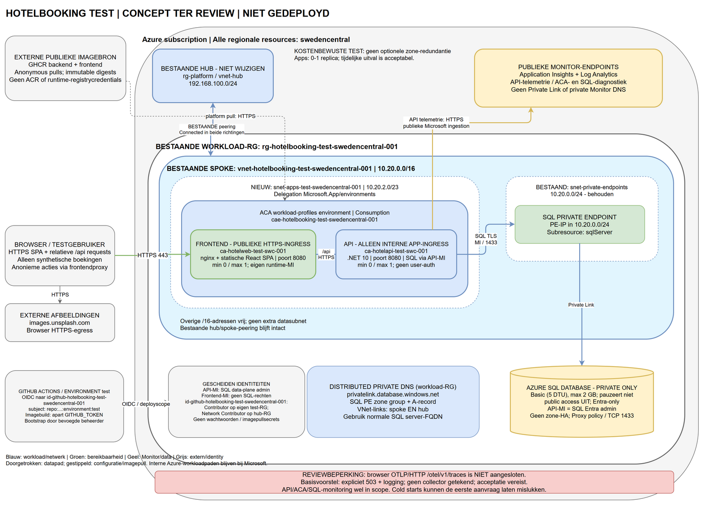

# Hotelbooking test - infrastructuurontwerp

**Status:** ontwerp afgerond; de gebruiker is op 2026-10-08 doorgegaan naar de implementatie. Implementatie vraagt eerst een Bicep-review en expliciete deploymenttoestemming. **Regiobesluit 2026-10-08:** de workload verhuist naar `polandcentral`; zie het regiobesluit in sectie 1.
**Datum:** 2026-10-08. Dit document bevat geen Bicep en geeft geen deploymenttoestemming.

## 1. Scope en vaste context

Dit ontwerp volgt de [actuele opdracht](../chores/chore-02.md). Alleen de testomgeving valt binnen de scope. De applicatiebron is read-only; hieronder staan infrastructuurkeuzes en containercontracten, geen voorgestelde wijzigingen aan applicatiecode.

**Vast uitgangspunt (door de gebruiker bevestigd):** de infrastructuur moet werken met de software zoals die is aangeleverd. De applicatie zelf wordt nooit gewijzigd; waar de app en de omgeving niet op elkaar aansluiten, wordt de infrastructuur of het platform-eigen containerasset (Dockerfile, nginx-configuratie, entrypoint) aangepast, niet de app.

| Onderdeel | Vastgelegde waarde |
|---|---|
| Azure location voor de workload (test en prod); de hub blijft in `swedencentral` | `polandcentral` |
| Availability zones voor zone-redundante infrastructuur (alleen prod) | Poland Central: `1`, `2`, `3` (bevestigd via `az account list-locations`); Container Apps verdeelt automatisch |
| Tenant | `<tenant-id>` (zie `az account show`) |
| Subscription | `<subscription-id>` (zie `az account show`) |
| Bestaande hub; niet wijzigen/verwijderen | `rg-platform` / `vnet-hub` / `192.168.100.0/24` |
| Test-workload-RG (naam blijft; resources staan in `polandcentral`) | `rg-hotelbooking-test-swedencentral-001` |
| Test-spoke | `vnet-hotelbooking-test-polandcentral-001` / `10.30.0.0/16` |
| PE-subnet test | `snet-private-endpoints` / `10.30.0.0/24` |
| Bestaande wederzijdse peering | Behouden; geen gateway transit of forwarded traffic toevoegen |

De regionale afkorting `plc` wordt alleen in de korte Container Apps-namen gebruikt om binnen de limiet van 32 tekens te blijven; de resource-location is `polandcentral`. DNS-namespaces hebben Azure-vaste namen en krijgen daarom geen `test`-token.

**Bestaande resources zonder `test` in de naam.** Alle nieuwe resources in dit ontwerp dragen het `test`-segment. Resources die al bestaan worden niet hernoemd, omdat dat de bestaande deployment zou verstoren: de hub (`rg-platform`, `vnet-hub`), het subnet `snet-private-endpoints` en de peerings `peer-spoke-to-hub` en `peer-hub-to-spoke`. Dat is een bewuste keuze en geen vergissing.

### Bevestigde reviewkeuzes (2026-10-08)

De gebruiker heeft bevestigd:

- Dit is uitsluitend een demo/test met fictieve gegevens.
- Cold starts en opnieuw proberen na een mislukte eerste aanvraag zijn acceptabel.
- Backendtelemetrie en infrastructuurlogs zijn voldoende; browsertraces zijn niet vereist voor deze test.
- De kosten moeten zo laag mogelijk blijven; een hard budgetbedrag is niet opgegeven.
- De omgeving is uitsluitend nodig voor de workshopdag op 2026-10-08; geen meerdaags gebruik gepland.
- Anonieme boekingsacties via de frontend zijn acceptabel met fictieve gegevens.
- Extra redundantie is niet vereist; optionele zone-redundantie blijft uit.
- SQL-tier: Basic (vaste tier), gekozen op basis van een prijsvergelijking.
- Verwacht gebruik: circa 5 gelijktijdige gebruikers.

Deze bevestiging is geen algemeen sign-off of deploymenttoestemming. De kostenprioriteit, anonieme testtoegang en afwezigheid van een redundantie-eis zijn eveneens bevestigd. Belasting, een eventueel hard budgetplafond, rechten en de overige hieronder genoemde risico's blijven afzonderlijke reviewpunten. Het ontbreken van browsertraces is geaccepteerd; zichtbare exporterfouten en het voorgestelde `/otel/`-503-contract zijn daarmee niet afzonderlijk goedgekeurd.

### Regiobesluit (2026-10-08): workload in Poland Central

- **Aanleiding:** de Container Apps-omgeving kon tweemaal niet worden aangemaakt in `swedencentral` (`ManagedEnvironmentNoAvailableCapacityInRegion`).
- **Besluit (gebruiker):** de workload wordt opnieuw uitgerold in `polandcentral`. De hub (`rg-platform` / `vnet-hub`, `swedencentral`) blijft ongewijzigd. Dit vervangt de eerdere afspraak dat alles in `swedencentral` staat, uitsluitend voor de workload.
- **Netwerk:** nieuwe spoke `vnet-hotelbooking-test-polandcentral-001` (`10.30.0.0/16`; private-endpointsubnet `10.30.0.0/24`, appsubnet `10.30.2.0/23`), globaal gepeerd met de hub (`peer-spoke-to-hub` en `peer-hub-to-polandcentral-spoke`). Geen overlap met de hub (`192.168.100.0/24`) en de Zweedse spoke (`10.20.0.0/16`).
- **Namen:** nieuwe resources gebruiken `polandcentral` (kort `plc` voor Container Apps). SQL-server, private endpoint, identiteiten, monitoring en omgeving zijn dus nieuwe resources.
- **Private DNS:** de bestaande zone `privatelink.database.windows.net` in de workload-RG wordt hergebruikt, met een extra link naar de nieuwe spoke (`vnetlink-spoke-polandcentral`).
- **Achtergebleven in Zweden, niet verwijderd:** spoke en peering, SQL met private endpoint, identiteiten, Log Analytics, Application Insights en de mislukte omgeving. Opruimen gebeurt alleen na afzonderlijke toestemming.
- **Gevolgen:** de workload staat in een andere regio dan de hub; globale peering heeft dataverkeerskosten. Beschikbaarheid en capaciteit in `polandcentral` zijn niet gecontroleerd.

### Omgevingen en parametermodel (test en prod)

Dit ontwerp beschrijft twee omgevingen in dezelfde subscription, vanuit **één template en twee parameterbestanden** (`workload.test.bicepparam` en `workload.prod.bicepparam`). Elk verschil tussen de omgevingen is een parameterwaarde en geen codetak: er komt geen `if (environmentName == ...)` in de template.

**Adresplan** (geen overlap; elke spoke peert in beide richtingen met de hub, de spokes peeren niet met elkaar):

| Netwerk | Adresruimte | Regio | Rol |
|---|---|---|---|
| Hub `vnet-hub` (`rg-platform`) | `192.168.100.0/24` | `swedencentral` | Bestaand, niet wijzigen |
| Zweedse restant `vnet-hotelbooking-test-swedencentral-001` | `10.20.0.0/16` | `swedencentral` | Overgebleven na de regiowissel; wordt opgeruimd na toestemming |
| Test-spoke `vnet-hotelbooking-test-polandcentral-001` | `10.30.0.0/16` | `polandcentral` | Test |
| Prod-spoke `vnet-hotelbooking-prod-polandcentral-001` | `10.31.0.0/16` | `polandcentral` | Prod (nieuw) |

Subnetindeling per spoke: `snet-private-endpoints` (`10.30.0.0/24` test, `10.31.0.0/24` prod) en `snet-apps-<env>-polandcentral-001` (`10.30.2.0/23` test, `10.31.2.0/23` prod, gedelegeerd aan `Microsoft.App/environments`).

**Resourcegroepen:** test `rg-hotelbooking-test-swedencentral-001` (de naam blijft, de resources staan in `polandcentral`) en prod `rg-hotelbooking-prod-polandcentral-001`.

**Peeringnamen zijn parameters:**

| | Spokekant | Hubkant |
|---|---|---|
| Test | `peer-spoke-to-hub` | `peer-hub-to-polandcentral-spoke` |
| Prod | `peer-spoke-to-hub` | `peer-hub-to-polandcentral-spoke-prod` |

**Parameters die per omgeving verschillen:**

| Parameter | Test | Prod |
|---|---|---|
| `environmentName` | `test` | `prod` |
| `location` | `polandcentral` | `polandcentral` |
| Adresruimte en subnetprefixen | zie adresplan | zie adresplan |
| Naam hubpeering | `peer-hub-to-polandcentral-spoke` | `peer-hub-to-polandcentral-spoke-prod` |
| `minReplicas` / `maxReplicas` (apps) | 0 / 1 | 3 / 10 (geen scale-to-zero) |
| Container Apps `zoneRedundant` | `false` | `true` |
| SQL-SKU | Basic (5 DTU) | General Purpose `GP_Gen5_2` (provisioned, 2 vCores), zone-redundant, zonder auto-pause. De prijs is niet vergeleken met `GP_S_Gen5_1` (serverless); keuze op verzoek van de gebruiker om door te gaan |
| SQL `zoneRedundant` | `false` | `true`, indien de gekozen SKU het ondersteunt |
| SQL auto-pause | geen (Basic kent het niet) | geen |
| Hub linken aan de DNS-zone | `true` | `false` (zie afwijking) |

De SQL-SKU is één parameter die zowel `Basic` als de prod-SKU moet kunnen aannemen, zonder tak in de template. Het seed van de SQL-servernaam blijft `uniqueString(resourceGroup().id)`. Voor test geeft dat exact dezelfde naam als nu (`sql-hotelbooking-test-polandcentral-001-qpfwih2rdacpe`). Prod krijgt vanzelf een eigen hash, omdat de resourcegroep anders is.

**Zone-redundantie:**
- Container Apps `zoneRedundant` kan alleen bij het aanmaken van een omgeving worden gezet. Test blijft daarom `false`.
- Zone-redundantie wordt alleen ingeschakeld in een regio die drie availability zones heeft. Dat wordt niet gefaket: wordt het niet ondersteund, dan blijft de parameter `false` en leggen we de afwijking vast.
- **Bevestigd (2026-10-08, `az account list-locations`):** `polandcentral` heeft drie logische zones (`1`, `2`, `3`).
- **Bevestigd (2026-10-08, `az sql db list-editions`):** in `polandcentral` is SQL-zone-redundantie beschikbaar voor General Purpose (`GP_S_Gen5_1`, `GP_Gen5_2`, `GP_S_Gen5_2`). Basic en Standard (S0 tot en met S3) ondersteunen het niet.
- **Nog te verifiëren:** zone-redundantie voor Container Apps in `polandcentral` (de preflight bij het schrijven van de template toont dat) en de prijs om te kiezen tussen `GP_Gen5_2` (provisioned) en `GP_S_Gen5_1` (serverless met auto-pause uitgeschakeld).

**Afwijking: DNS-link naar de hub is een parameter.** Elke omgeving heeft een eigen `privatelink.database.windows.net`-zone in de eigen resourcegroep. De test-zone is al aan de hub gelinkt. Een VNet kan niet aan twee zones met dezelfde naam gelinkt zijn, dus de prod-zone wordt **alleen aan de prod-spoke** gelinkt (`linkHubToDns`: test `true`, prod `false`). Gevolg: de hub en alles wat via de hub zou resolven, lost de prod-SQL niet privé op. Dat is aanvaardbaar, omdat alleen de workload zelf SQL benadert.

### Aannames en nog te bevestigen randvoorwaarden

- Kleine, niet-bedrijfskritische test met uitsluitend synthetische namen en e-mailadressen; geen betaalverkeer of echte klantgegevens.
- De gebruiker wil de kosten zo laag mogelijk houden en stelt geen eis aan extra redundantie. Er is geen overeengekomen SLA, RTO, RPO, piekbelasting of hard maandbudgetplafond. Er wordt geen beschikbaarheids- of hersteltijdgarantie beloofd.
- Lage idle-computekosten wegen zwaarder dan directe responstijd en actieve multi-zone beschikbaarheid. De gebruiker accepteert een mislukte eerste aanvraag tijdens een cold start en kan opnieuw proberen.
- Browsertraces zijn in dit basisontwerp expliciet niet beschikbaar; API-telemetrie en infrastructuurlogs wel. Dit is een reviewpunt, geen stilzwijgende claim van volledige observability.

Afwijzing van een van deze aannames betekent: ontwerp aanpassen en opnieuw reviewen, niet ongemerkt extra services of permanente replicas toevoegen.

## Uitleg in gewone taal

Wat is al gedaan en wat is alleen een voorstel?

- **Al aanwezig in Azure:** de hub en de test-resourcegroep, spoke, private-endpointsubnet en verbindingen in beide richtingen. Die bestaande onderdelen worden hergebruikt en zijn in deze ontwerpfase niet aangepast.
- **Onderzocht:** wat de aangeleverde applicatie nodig heeft. De frontend toont pagina's; de backend verwerkt aanvragen; de database bewaart hotels en fictieve boekingen. Applicatiecode is niet gewijzigd.
- **Gemaakt:** dit ontwerpdocument en een bewerkbaar architectuurdiagram. De voorgestelde hosting, database en identiteiten zijn nog niet aangemaakt; er is geen nieuwe Bicep gebouwd of deployment uitgevoerd.

Waarom deze keuzes?

| Begrip | Betekenis en reden |
|---|---|
| Frontend | De website die de gebruiker ziet. Dit is de publieke voordeur. |
| Backend / API | De dienst die hotels leest en boekingen verwerkt. Nginx, de webserver bij de frontend, stuurt `/api`-aanvragen intern door. Geen tweede openbare API-ingang nodig. |
| Container Apps | Azure start en beheert de twee containers. Het Consumption-profiel voorkomt dat we een eigen cluster met permanent draaiende machines moeten beheren. |
| Scale-to-zero | Bij rust mogen de applicatiecontainers uit: nul actieve kopieen. Een aanvraag start ze weer op. Dat verlaagt idle-computekosten, maar kan wachten of opnieuw proberen vereisen. |
| SQL Basic | Een kleine databasetier met een vaste dagprijs (5 DTU, maximaal 2 GB; circa $0,16 per dag volgens de publieke lijstprijs). Hij pauzeert niet en blijft kosten tot hij wordt opgeruimd. Boekingen blijven opgeslagen. Blijkt hij te traag, dan is een grotere tier een kleine aanpassing. |
| Private endpoint | Een prive-netwerkadres voor SQL in het bestaande PE-subnet. SQL heeft geen openbare ingang, ook al is de website publiek. |
| Spoke en peering | De spoke is ons eigen netwerkdeel; peering verbindt dit met de bestaande hub. Een extra appsubnet houdt ACA-infrastructuur apart van SQL-private endpoints. |
| Private DNS | Het interne adresboek vertaalt de SQL-servernaam naar het private endpoint. Beide netwerken krijgen een link naar deze workloadzone. |
| Managed identity | Een door Azure beheerde identiteit voor de API: geen databasewachtwoord. Een aparte deploy-identiteit mag infrastructuur uitrollen, niet als applicatie inloggen op SQL. |
| Geen extra redundantie | We reserveren geen extra appkopieen of zone-redundante opzet voor deze niet-kritische test. Bij storing mag de test tijdelijk uitvallen. |
| Monitoring | Backendfouten en infrastructuurlogs helpen problemen vinden. Browsertraces zijn niet nodig volgens jouw keuze; hun bestaande exportprobleem blijft zichtbaar en is gedocumenteerd. |

### Levensduur en kosten na de workshop

Gebruik is bevestigd voor uitsluitend 2026-10-08. Een kostenraming moet daarom uitgaan van de resterende actieve workshopuren en de tijd tot opruimen, niet van continu maandgebruik. De exacte eindtijd is niet opgegeven en een totaalbedrag is niet berekend. Bevestigd gebruik: circa 5 gelijktijdige gebruikers. De SQL-tier is Basic (zie sectie 4).

Scale-to-zero verwijdert geen resources. SQL Basic pauzeert niet en de private endpoint en monitoring blijven ook kosten veroorzaken zolang ze bestaan. Het voorkomen van onnodige levensduur is daarom belangrijker dan alleen idle compute laten pauzeren.

**Voorgesteld opruimproces, niet uitgevoerd en niet geautoriseerd:** na de workshop eerst bevestigen dat fictieve gegevens en testlogs weg mogen. Inventariseer dan expliciet de workloadresources en afhankelijkheden. Het verwijderen van de workload-RG verwijdert ook de bestaande spoke en de peering aan de spokekant; doe dit uitsluitend na afzonderlijke toestemming. De hub-resourcegroep en hub-VNet mogen nooit verwijderd worden. De achterblijvende hub-side peering vereist mogelijk een aparte gerichte cleanup; dat wijzigt de hub en valt buiten de huidige toestemming. Spreek dat afzonderlijk af voordat resources verwijderd worden. Er is geen automatische delete of cleanup gepland.

**Kosten zijn laag geprioriteerd, niet exact berekend.** De SQL-tier is vergeleken op de publieke lijstprijzen voor Sweden Central (peildatum 2026-10-08; geen offerte): Basic circa $0,16 per dag, Standard S0 circa $0,48 per dag, serverless circa $0,57 per vCore-uur dat de database actief is. Het gratis SQL-aanbod zou goedkoper zijn, maar de gebruiker koos Basic; of dit abonnement voor dat aanbod in aanmerking komt, is niet gecontroleerd. De kosten van de private endpoint zijn niet opgezocht en niet meegeteld. Gebruik een kostenraming en, zodra een budgetbedrag bekend is, budgetmeldingen; een budgetmelding stopt resources niet automatisch. Verwijder ongebruikte testresources alleen na toestemming en nooit de bestaande hub.

## 2. Applicatieanalyse

### 2.1 Inventaris en runtime

De [API-entrypoint](../workload-app/backend/HotelBooking.Api/Program.cs), services, modellen, database-initialisatie en seedstructuur zijn onderzocht, evenals de frontendroutes, alle UI-componenten, API-client, telemetrie, buildconfiguratie en bestaande containerassets. De seeddata bestaat uit statische hotel-/kamerrecords; hotelafbeeldingen verwijzen naar `images.unsplash.com`. De lockfile legt frontenddependencies vast. Er zijn geen aparte worker, queue-consumer, cache, objectstore, betaalservice of geplande taken aangetroffen.

| Onderdeel | Bevinding | Infrastructuurgevolg |
|---|---|---|
| Backend | ASP.NET Core minimal API, .NET 10, EF Core SQL Server; Azure Monitor OpenTelemetry ASP.NET Core aanwezig | Bestaande Linux-container gebruiken; TCP 8080 als containerpoort |
| Frontend | React 19, Vite 7, TypeScript 5, Tailwind 4; statische SPA met client-side routing | Bestaande Node-build/nginx-runtime gebruiken; nginx op TCP 8080; SPA fallback behouden |
| UI-routes | `/`, `/hotels/:id`, `/my-bookings` | Diepe links moeten naar `index.html` kunnen terugvallen |
| API-koppeling | [API-client](../workload-app/frontend/src/api/client.ts) gebruikt relatieve `/api`-URL's | Browser praat uitsluitend met de frontend; nginx praat met de interne API |
| Productieproxy | [nginx-template](../workload-app/frontend/nginx/default.conf.template) behoudt `/api/...` bij proxying | `BACKEND_URL` zonder pad of trailing slash naar backend-FQDN |
| Database | SQL Server-provider; tabellen Hotels, Rooms, Bookings; kamers behoren tot hotels | Azure SQL Database, geen PostgreSQL/Cosmos DB of database in een container |
| Opstart | `EnsureCreatedAsync`, daarna seed als Hotels leeg is, voordat de API luistert | SQL en MI-rechten moeten vooraf klaar zijn; slechts een eerste initializer tegelijk |
| Lokale configuratie | LocalDB als standaard; lokale API 5000 en Vite 5173 | Niet gebruiken in Azure; connection string expliciet injecteren |
| Backendobservability | Azure Monitor alleen actief bij `APPLICATIONINSIGHTS_CONNECTION_STRING` | Resource-derived App Insights-configuratie injecteren |
| Browserobservability | [telemetrie](../workload-app/frontend/src/telemetry.ts) start altijd, OTLP/HTTP-protobuf naar `/otel/v1/traces` | Huidige nginx biedt geen collectorroute; zie sectie 8 |
| Sessies en bestanden | Geen server-side sessiestaat of workloadbestanden vereist | Containers mogen verdwijnen; SQL bewaart de duurzame staat |
| Auth | Geen gebruikerslogin, tokenvalidatie of autorisatie; API-CORS staat elke origin toe | Alleen synthetische testdata; netwerkisolatie is geen gebruikersautorisatie |

De backend heeft static-file-middleware, maar zijn buildcontext bevat geen frontendbuild. Het ontwerp veronderstelt dus niet dat de API ook de SPA serveert. De ontwikkelproxy heeft `/agent-chat`, maar de API registreert daarvoor geen endpoint; geen AI-service toevoegen.

### 2.2 API-oppervlak

| Methode | Route | Functie |
|---|---|---|
| GET | `/api/hotels/` | Zoek hotels; optionele city, country, minStars, maxPrice, guests |
| GET | `/api/hotels/{id}` | Hotel inclusief kamers |
| GET | `/api/hotels/{id}/rooms` | Beschikbare kamers, optionele guests |
| POST | `/api/bookings/` | Boek hotel/kamer; sla gastnaam, e-mail en datums op |
| GET | `/api/bookings/{id}` | Lees boeking op ID |
| GET | `/api/bookings/by-email/{email}` | Lees alle boekingen voor een opgegeven e-mail |
| DELETE | `/api/bookings/{id}` | Zet bestaande bevestigde boeking op Cancelled |
| GET | `/openapi/v1.json` | OpenAPI-document; blijft uitsluitend aan de interne backendzijde |

**Bestaande contractafwijking, statisch vastgesteld:** [Booking-model](../workload-app/backend/HotelBooking.Api/Models/Booking.cs) gebruikt een enum voor status; er is geen JSON-string-enumconfiguratie zichtbaar in de API. [BookingCard](../workload-app/frontend/src/components/BookingCard.tsx) verwacht juist tekstwaarden zoals `Confirmed`. Bij standaard JSON-serialisatie is een numerieke status te verwachten, waardoor statusweergave en de annuleerknop niet overeenkomen met het frontendcontract. De string-conversie voor SQL-opslag verandert het JSON-contract niet. Dit is niet door infrastructuur op te lossen: geen bronwijziging of proxy-payloadherschrijving voorstellen. Een functionele controle van het bestaande image moet dit bevestigen; eventuele correctie is eigendom van het applicatieteam.

Er is geen expliciet health-endpoint. Een TCP-probe bewijst dat het proces luistert, niet dat SQL op dat moment gezond is. Boekingen reserveren geen datumgebonden inventaris; beschikbaarheid is een kamerflag. Daarmee wordt geen productiegeschikt reserveringsplatform of concurrentiegarantie verondersteld.

### 2.3 Images en buildcontract

De applicatie-images worden gebouwd door de [workflow](../.github/workflows/build-and-publish-workload-images.yml) bij wijzigingen onder `workload-app` en bij handmatige dispatch. De gebruiker had alleen leesrechten op de organisatierepository en heeft daarom een eigen fork gemaakt (`Perry-b29/az-platform-engineering-workshop`).

**Gekozen bron voor de eerste deployment: de publieke workshopimages**, als standaardwaarde van twee template-parameters (`latest`-tag, zoals de implementatieopdracht vraagt). Op 2026-10-08 zijn beide manifests zonder authenticatie opgehaald (HTTP 200). `latest` verwijst dan naar de volgende digests; de `sha-`tag is `sha-e175410b82e9aa741ab8fe44b155acc0d37912ad`:

- `ghcr.io/azureholic/az-platform-engineering-workshop/backend:latest` = `sha256:5552cfcd44e6d30063b2f5be2ae179f12feb6f59c14527a088e18315e17a97a2`
- `ghcr.io/azureholic/az-platform-engineering-workshop/frontend:latest` = `sha256:36f846d8a9ec3504f1c4e172428c5e2f7584acaf98128912dfc8dae79792f9c4`

`latest` is een veranderlijke tag: de pull-bron is dus niet vastgepind en een latere pull kan een andere image opleveren. De `sha-`tag is gebouwd uit commit `e175410`, de lokaal geanalyseerde code is commit `c9e4961`; of beide overeenkomen is niet vergeleken (zie open punten).

**Later:** de eigen images uit de fork `Perry-b29/az-platform-engineering-workshop` worden later via de pipeline gepubliceerd en via dezelfde twee parameters in gebruik genomen. De eerder handmatig gebouwde fork-images (run 37759527845, commit `c9e4961`) maken geen deel uit van de eerste deployment.

Geen registrycredentials of ACR toevoegen; de workflow zet packagevisibility niet zelf op public, dus controleer de anonieme toegang opnieuw vlak voor een deployment. Een latere wijziging van de bron vraagt nieuwe digests.

De backend gebruikt de bestaande MCR SDK/runtime `10.0`; frontend MCR Node `24` en nginx `1.28`. Buildcontext is steeds de eigen servicemap. Geen nieuwe builds of bronwijzigingen in deze ontwerpfase.

## 3. Architectuur en hostingkeuze

[Bewerkbaar draw.io-bronbestand](./architecture.drawio). De PNG bevat ook embedded diagram-XML. Het diagram toont het voorgestelde ontwerp, niet al gedeployde resources.

**Keuze:** een VNet-geintegreerde Azure Container Apps workload-profiles environment met uitsluitend het Consumption-profiel. Beide apps delen deze environment: alleen de frontend heeft externe HTTPS-ingress, de API heeft interne ingress die alleen vanuit deze environment bereikbaar is.

| Alternatief | Beoordeling en reden om niet te kiezen |
|---|---|
| Container Apps Consumption | HTTP-scale-to-zero, managed identity en interne ingress zonder clusterbeheer passen bij de twee stateless containers |
| App Service for Containers | Geschikt voor webapps en identity, maar een draaiend App Service-plan blijft capaciteit/kosten houden bij idle |
| AKS | Meer netwerk- en schedulingcontrole, maar cluster/nodepoolbeheer en basiscapaciteit zijn disproportioneel voor deze kleine test |
| Azure Container Instances | Weinig beheer, maar geen vergelijkbare ingebouwde HTTP-autoscaling naar nul en tweedelige ingressopzet |
| Alleen statische hosting | Lost het private API-/SQL-pad en de bestaande nginx-proxy niet zelfstandig op; meer losse integraties nodig |

Deze vergelijking is gebaseerd op workloadfit, niet op een productie-SLA of een actuele prijsberekening. De gekozen dienst moet bij implementatie qua quota en beschikbaarheid in `swedencentral` worden gevalideerd.

## 4. Resourcecatalogus en capaciteit

> **Geldend regiobesluit (2026-10-08, zie sectie 1):** de workload draait in `polandcentral`. Lees in de tabellen hieronder voor nieuwe resources `swedencentral` als `polandcentral` (kort `swc` als `plc`) en het spokebereik `10.20.x.x` als `10.30.x.x`: spoke `vnet-hotelbooking-test-polandcentral-001` (`10.30.0.0/16`), PE-subnet `snet-private-endpoints` (`10.30.0.0/24`), appsubnet `snet-apps-test-polandcentral-001` (`10.30.2.0/23`), omgeving `cae-hotelbooking-test-polandcentral-001`, apps `ca-hotelapi-test-plc-001` en `ca-hotelweb-test-plc-001`. De template in `infra/workload/` is de bron van waarheid. De nieuwe resources staan in de bestaande resourcegroep `rg-hotelbooking-test-swedencentral-001`, die niet hernoemd kan worden. Uitzondering: de hub blijft in `swedencentral`.

Alle nieuwe workloadresources, inclusief MI's en distributed Private DNS, komen in de bestaande workload-RG. Er komt geen nieuwe resourcegroep of tweede VNet.

| Resource | Naam/contract | Voorgestelde testconfiguratie |
|---|---|---|
| Container Apps environment | `cae-hotelbooking-<env>-polandcentral-001` | Workload profiles, Consumption; external environment (publicNetworkAccess Enabled), VNet-integratie; zoneRedundant: parameter (test false, prod true; alleen bij aanmaken) |
| Frontend container app | `ca-hotelweb-<env>-plc-001` | 0.25 vCPU, 0.5 GiB; TCP 8080; externe HTTP-ingress met HTTPS verplicht |
| Backend container app | `ca-hotelapi-<env>-plc-001` | 0.5 vCPU, 1 GiB; TCP 8080; interne HTTP-ingress; HTTPS tussen apps |
| SQL logical server | `sql-hotelbooking-<env>-polandcentral-<suffix>` | suffix = 13 tekens van deterministische uniqueString(workload-RG-ID); Entra-only, TLS >=1.2 |
| SQL database | `sqldb-hotelbooking-<env>-polandcentral-001` | Basic (5 DTU), maximaal 2 GB; geen auto-pause; lokaal redundante backupstorage, PITR 7 dagen |
| SQL private endpoint | `pep-sql-hotelbooking-<env>-polandcentral-001` | Subresource `sqlServer`, bestaand PE-subnet |
| Private DNS | `privatelink.database.windows.net` | Workload-RG; zone group op SQL PE; links naar spoke en hub, auto-registration=false |
| API-runtime-UAMI | `id-hotelapi-<env>-polandcentral-001` | SQL Entra admin; geen Azure beheerrollen |
| Frontend-runtime-UAMI | `id-hotelweb-<env>-polandcentral-001` | Geen SQL- of beheerrechten; gescheiden van API en CI |
| GitHub Actions deploy-UAMI | `id-github-hotelbooking-test-swedencentral-001` | Dedicated CI/CD-identiteit voor de omgeving `test`; scope in sectie 7 |
| Log Analytics | `log-hotelbooking-<env>-polandcentral-001` | Public ingestion/query, PerGB2018, retentie 30 dagen |
| Application Insights | `appi-hotelbooking-<env>-polandcentral-001` | Workspace-based; public ingestion/query; gekoppeld aan genoemde workspace |

**Scale-to-zero:** beide apps `minReplicas=0`, `maxReplicas=1`, een expliciete HTTP-scaler met concurrentiedrempel 10, single-revision traffic mode. Geen CPU-only scaler die een slapende app niet via HTTP kan wekken. Geen periodieke synthetische probe die de workload voortdurend wakker houdt. Max 1 serialiseert de eerste schemainitialisatie en houdt testkosten voorspelbaar; het is geen horizontaal schaalbaar productieprofiel.

**Redundantie:** op verzoek van de gebruiker wordt geen optionele zone-redundantie ingeschakeld voor de ACA-environment of SQL. Beide apps blijven op min 0 / max 1 replica. Azure behoudt de ingebouwde platformredundantie; dit betekent niet dat alle onderliggende servicekopieen kunnen of moeten worden uitgezet. Er is geen garantie op beschikbaarheid tijdens zone-uitval. Uitschakelen van ACA-zone-redundantie is hier een keuze om geen extra HA-eis op te leggen, geen bewezen afzonderlijke prijsbesparing. Indien alsnog zone-redundante resources nodig zijn, gelden uitsluitend Sweden Central-zones 1, 2 en 3 en is een nieuwe review nodig.

SQL Basic heeft een vaste dagprijs en pauzeert niet. SQL, Private Link, Monitor en eventueel environment/platformfees maken idle-kosten niet nul. Prijs en SKU-beschikbaarheid in Sweden Central worden bij de preflight opnieuw gecontroleerd; er is geen budgetplafond aangeleverd.

**Belasting:** de gebruiker verwacht circa 5 gelijktijdige gebruikers. Een replica per app en SQL Basic zijn daarvoor bedoeld; dit is niet gemeten. Blijkt de database traag, dan is Standard S0 (circa $0,48 per dag) een wijziging van een parameter en geen nieuwe architectuurkeuze.

## 5. Netwerk, DNS en exposure

> **Geldend regiobesluit (2026-10-08):** de spoke staat in `polandcentral` (`10.30.0.0/16`) en is globaal gepeerd met de hub in `swedencentral` (`192.168.100.0/24`). De Private DNS-zone `privatelink.database.windows.net` blijft in de workload-resourcegroep en krijgt links naar de nieuwe spoke en de hub, beide zonder registratie. De adressen en namen in de tekst hieronder verwijzen naar de eerdere Zweedse spoke (`10.20.x.x`); de template is leidend.

### Subnets

| Subnet | Prefix | Actie en doel |
|---|---|---|
| `snet-private-endpoints` | `10.30.0.0/24` (test), `10.31.0.0/24` (prod) | Per spoke; uitsluitend SQL PE toevoegen; huidig PE-policycontract behouden |
| `snet-apps-<env>-polandcentral-001` | `10.30.2.0/23` (test), `10.31.2.0/23` (prod) | Nieuw; uitsluitend ACA-infrastructuur, delegation `Microsoft.App/environments` |

Het nieuwe /23 overlapt het bestaande /24 noch `192.168.100.0/24`. Een workload-profiles environment ondersteunt kleinere subnets vanaf /27; /23 is bewust gekozen voor groeiruimte binnen de bestaande /16, niet omdat het minimum /23 is. Geen datasubnet toevoegen: SQL is PaaS en wordt via het bestaande PE-subnet benaderd. De overige adressen blijven vrij; geen toekomstige services of delegations vooruit plannen.

### Verbindingspaden

1. Browser -> frontend HTTPS 443 op het door ACA uitgegeven FQDN. Platform-TLS; `allowInsecure=false`. Geen eigen domein, Front Door of App Gateway nodig voor deze test.
2. Browser `/api/...` -> nginx -> `https://<backend-app-FQDN>` binnen dezelfde ACA-environment. Path behouden; backend `external=false`. Het bestaande nginx-contract gebruikt HTTPS maar configureert geen expliciete upstream-certificaatvalidatie. De platform-owned nginx-assets moeten bij implementatie verificatie van het backendcertificaat en de systeem-CA-truststore expliciet inschakelen; bepaal de daadwerkelijke CA-bundlelocatie in het bestaande MCR-image, in plaats van een onbevestigd pad te gebruiken. De browser krijgt geen backendbasis-URL en maakt geen rechtstreekse backendcall. Dezelfde-environment service-to-service route blijft binnen ACA/Microsoft; een FQDN met een publieke DNS-naam impliceert niet dat interne app-ingress publiek bereikbaar is.
3. API -> `<sqlserver>.database.windows.net:1433` -> SQL PE in `10.20.0.0/24`. De template stelt geen connection policy in; de standaardwaarde van de module geldt. Geen 'Allow Azure services' firewallregel of openbaar SQL-pad.
4. SQL publieke servicenaam verwijst via CNAME naar de workloadzone `privatelink.database.windows.net`, die via de zone group een A-record naar de PE-IP krijgt. De connection string gebruikt de normale server-FQDN, niet de PE-IP of privatelink-hostnaam.
5. Private DNS-zone bestaat in de workload-RG en is gelinkt naar zowel spoke als hub. VNet-peering geeft geen automatische DNS-zonezichtbaarheid; beide links zijn expliciet nodig. Behoud Azure-provided DNS; er is geen bestaande custom DNS-server/resolver aangetoond.
6. API -> publieke Azure Monitor-ingestion over HTTPS; ACA-diagnostiek -> publieke Log Analytics. Deze Microsoft-servicepaden zijn doelbewust niet via Private Link geconfigureerd.
7. Containerplatform -> publieke GHCR en bijbehorende downloadhosts over HTTPS voor anonymous imagepulls. Browser -> Unsplash over HTTPS voor hotelafbeeldingen. Dit zijn externe bronnen, geen publieke Azure-workloaddiensten.

**Publieke exposure:** alleen frontend en Monitor-ingestion/query. De environment heeft een publiek IP voor de frontend; de backend heeft geen eigen publieke ingress. Geen ACA-environment-PE in deze gedeelde opzet: uitschakelen van environment-public access zou ook de frontend blokkeren. Backendisolatie gebeurt via interne app-ingress, SQL via PE plus uitgeschakelde public access. Er worden geen Monitor private endpoints, private Monitor-DNS-zones of Private Link Scope ingericht.

De backend is bewust alleen vanuit dezelfde environment bereikbaar, niet rechtstreeks vanuit de hub of een willekeurige spoke-VM. Verander die beperking niet om een externe controle te laten slagen. Alleen workload-DNS-links gebruiken de bestaande hub-VNet-ID; hubsubnets, DNS-instellingen, routing en de hubdeployment worden niet gewijzigd.

Geen nieuwe firewall, NAT Gateway, UDR of NSG in dit basisontwerp. Er is geen geforceerde hub-egress of centrale firewallroute aangetoond. Inboundisolatie betekent hier niet dat alle outboundtoegang al wordt gefilterd. Bevestig bij implementatie de ACA-platformafhankelijkheden, Entra-identity-endpoints, Monitor en GHCR voordat netwerkfilters worden toegevoegd; default deny zonder die inventaris breekt opstarten/pulls.

## 6. Opstart-, configuratie- en readinesscontract

| App | Configuratie | Waarde/bron |
|---|---|---|
| Frontend | `BACKEND_URL` | `https://<backend-app-FQDN>` zonder pad/trailing slash; door bestaande entrypoint gevalideerd |
| Frontend | Poort | 8080; nginx draait non-root en schrijft tijdelijke configuratie onder `/tmp` |
| Backend | `ASPNETCORE_HTTP_PORTS` | 8080; image bevat dit al |
| Backend | `ASPNETCORE_ENVIRONMENT` | Production (runtimegedrag, niet de naam van de testomgeving) |
| Backend | `ConnectionStrings__HotelDb` | `Server=tcp:<SQL-FQDN>,1433;Database=<database-name>;Authentication=Active Directory Default;Encrypt=True;TrustServerCertificate=False;Connection Timeout=60;` |
| Backend | `AZURE_CLIENT_ID` | clientId van API-runtime-UAMI, niet principalId |
| Backend | `APPLICATIONINSIGHTS_CONNECTION_STRING` | Afgeleid van App Insights-resource; geen wachtwoord of private key |

SQL Entra admin: `principalType=Application`, `sid=<API-MI.principalId>`, login/displayname van API-MI, tenantId uit context, `azureADOnlyAuthentication=true`. Dit is de expliciete workshopvereenvoudiging: de app heeft beheerrechten op SQL voor schema/seed, niet least-privilege databasegebruiksrechten. De lokale deployer en CI-MI worden geen SQL data-plane admin.

Geen secrets in app-env, registryconfig, outputs of parametercontract. App Insights instrumentation key in de connection string is volgens Microsoft een resource-identificator, geen authenticatiesecret; dit vervangt geen bescherming tegen misbruik van ingestion.

**Probes:** de backend krijgt een TCP-startupprobe op poort 8080, iedere 10 s met timeout 3 s en `failureThreshold` 10 (circa 100 s budget). Readiness en liveness gebruiken de platformstandaard, net als de frontend. Geen `/health` aannemen. API-startup opent pas de poort na database-initialisatie.

**Cold starts:** eerst kan ACA de frontend wekken, daarna wekt de proxyrequest de API. SQL Basic pauzeert niet, dus de koude start zit alleen in de containers. De API bevat geen expliciete SQL retry-policy rond `EnsureCreatedAsync`; als SQL, de private endpoint of de private DNS bij de eerste start nog niet bereikbaar zijn, kan die start mislukken. Een langere connect-timeout garandeert geen succesvolle eerste login. Het platform moet dan de gestopte container herstarten; de eerste webaanvraag kan 502/504 opleveren. Niet verbergen met succesvormige responses of automatisch herhalen van POST/DELETE. Startupprobebudget is geen garantie voor de totale externe ingress-timeout.

De bestaande nginx heeft een default upstream-timeout en geen runtime-DNS-resolvercontract. Zijn statisch opgeloste backendhost kan na een environmentwijziging opnieuw starten vereisen. Houd de environment/FQDN stabiel en herstart frontend na een backendhostwijziging. Geen cold-start-SLA claimen of applicatiereparatie voorstellen; acceptatie of afwijzing hoort bij review.

## 7. Identity en CI/CD

Runtime- en deploy-UAMI's zijn gescheiden. Frontend krijgt geen SQL-rechten. De API krijgt geen Contributor/Owner op Azure-resources; SQL-beheer is uitsluitend via de Entra-adminconfiguratie.

De dedicated GitHub Actions-identiteit voor `test` (`id-github-hotelbooking-test-swedencentral-001`) krijgt:

- Contributor op `rg-hotelbooking-test-swedencentral-001`.
- Network Contributor op `rg-platform` (de hub-resourcegroep), conform het netwerkcontract voor nested AVM-deployments en VNet-peering/DNS-linkvalidatie. **Bewuste afwijking van een formulering als "alleen op de hub-VNet":** de AVM-module maakt de peering aan de hubkant via een geneste deployment in de hub-resourcegroep. Die vraagt `Microsoft.Resources/deployments/write` op resourcegroepniveau en faalt als de rol alleen op de VNet staat. Dit is breder dan alleen de hub-VNet; pipelinebeleid mag die rechten niet gebruiken om de bestaande hub te wijzigen of te verwijderen.
- Geen Owner, geen SQL data-plane rechten en geen subscriptionbrede Contributor. De resourcegroep bestaat al: gewone workloaddeployments worden resource-group-scoped, niet opnieuw via een subscriptionbootstrap.

Contributor kan geen RBAC-grants aanmaken. Bootstrap van deze CI-rollen en federated credential hoort bij een geautoriseerde beheerder met role-assignmentrechten, niet bij de runtime-identiteit. Als implementatie nieuwe RBAC-grants nodig blijkt te hebben, moet die expliciet gebootstrapt of minimaal gedelegeerd worden; nooit aannemen dat Contributor dit kan.

GitHub OIDC-contract voor uitsluitend deze omgeving:

- Issuer `https://token.actions.githubusercontent.com`.
- Audience `api://AzureADTokenExchange`.
- Subject `repo:<owner>/<repo>:environment:test`, gegenereerd uit de repository waarin de pipeline draait. Dat is de organisatierepository of, zolang de gebruiker daar geen schrijfrechten heeft, de fork `Perry-b29/az-platform-engineering-workshop`.
- Deploymentjob gebruikt GitHub Environment `test` en `id-token: write`; Azure IDs/resourcegroep zijn environment-variables, geen secrets.
- Imagebuild publiceert met `GITHUB_TOKEN` en `packages: write`; dat token gaat niet naar ACA. Publicatie en Azure-deployment gebruiken verschillende authenticatiepaden.

De eerdere GitHub CLI-controle rapporteerde READ voor het ingelogde account. Beheerderstoegang voor workflow-/environment-/packagewijzigingen is nog niet aangetoond; dit is een implementatievoorwaarde, geen uitgevoerde bootstrap.

### Decision record: API-identiteit als SQL Entra-admin

- **Besluit:** de user-assigned managed identity van de backend is declaratief de Microsoft Entra-admin van de SQL-server, met uitsluitend Entra-authenticatie en uitgeschakelde publieke toegang.
- **Context:** de applicatie maakt bij het opstarten zelf het databaseschema en de seeddata aan en wordt niet gewijzigd. Ze heeft dus schemabeheerrechten nodig. SQL is alleen via de private endpoint bereikbaar, dus een handmatige of scriptmatige gebruikersaanmaak na de deployment (post-deploy-opdracht, deployment script of jumpbox) wordt vermeden.
- **Gevolg:** een identiteit heeft zowel beheer- als dataplane-rechten. Wie de API-identiteit overneemt, heeft volledige toegang tot de database.
- **Status:** workshopvereenvoudiging, geaccepteerd voor deze test met fictieve gegevens. De workshopopzet is er niet voor aangepast.
- **Productie:** een Entra-**groep** als SQL-admin en voor de applicatie een **contained database user met minimale rechten** (`db_datareader`, `db_datawriter` en `EXECUTE`); schema-aanmaak hoort dan in een afzonderlijke migratiestap met een eigen identiteit.

## 8. Monitoring en de browsertelemetriebeperking

**Wel in scope:** API-request/dependency/exception-telemetrie via de bestaande Azure Monitor-distro naar publieke workspace-based App Insights. ACA `appLogsConfiguration.destination=azure-monitor` en environment-diagnostic settings naar de workload-Log Analytics-workspace; geen Log Analytics shared key in env of template. Controleer ondersteunde logcategorieen bij implementatie. SQL-diagnostic settings naar dezelfde workspace, met nadruk op fouten/performance en zonder onnodige query-/PII-payloads.

**Niet werkend in het huidige containercontract:** browser OTLP/HTTP-protobuf naar `/otel/v1/traces`. Nginx heeft alleen `/api/` en SPA fallback; `/otel` is dus geen telemetryreceiver. De API accepteert dit protocol niet. Een App Insights connection string als nginx-proxydoel is geen oplossing. De ACA managed OpenTelemetry-agent accepteert volgens de geraadpleegde documentatie alleen gRPC en kan deze browser-HTTP-export niet rechtstreeks ontvangen.

**Voorgestelde basisbeslissing, expliciet ter acceptatie:** geen aparte collector, nieuw Azure-product of ongeteste image toevoegen. Browsertraces vallen buiten de scope van dit basisontwerp; de platform-owned nginx-config moet voor `/otel/` expliciet HTTP 503 retourneren en die verzoeken loggen, in plaats van HTML/schijnsucces. De browserinitializer blijft ongewijzigd, dus exporterfouten kunnen zichtbaar blijven. De UI/API-functionaliteit is niet afhankelijk van geslaagde exports. Dit is een containerassetwijziging voor een follow-up implementation, niet nu uitgevoerd.

Als browsertraces een harde eis zijn, is dit ontwerp nog niet geschikt voor sign-off. Er is dan een afzonderlijk te reviewen OTLP/HTTP-naar-Monitor ontvangst-/exportpad nodig, inclusief imageherkomst, authenticatie en misbruikbeperking. Dat pad wordt niet verzonnen of stilzwijgend als beschikbaar getekend.

Operationele controles: alarmen op aanhoudende API 5xx, crash/restartpieken en SQL-fouten; dashboard voor latency/cold starts, replica-aantallen, SQL CPU/opslag en ingestionvolume. Geen permanent keepalive-verkeer. Beperk e-mailadressen in nginx-requestlogs via een redacted logformaat voor `/api/bookings/by-email/...`; geen bodies loggen. Monitor blijft publiek; bestaande exporter gebruikt resource-ID-gebaseerde ingestionidentificatie, geen bewezen Entra-only ingestion. Dit risico hoort bij testacceptatie.

## 9. WAF-beslissingen en trade-offs

Elke rij beoordeelt alle vijf pijlers; de primaire optimalisatie is vetgedrukt.

| Besluit | Security | Reliability | Performance | Cost | Operational Excellence |
|---|---|---|---|---|---|
| ACA Consumption in een environment | Private API-ingress; publieke proxy blijft toegang tot API-acties bieden | Geen optionele zone-redundantie; min 0/max 1 biedt geen continue beschikbaarheid | HTTP wekt apps; koude start is traag | **Idle appcompute naar nul** | Geen clusterbeheer; expliciete ingress/probes |
| SQL Basic via PE | **Entra-only, TLS, public access uit** | Platformbackup; geen resume-vertraging door auto-pause | Beperkt tot 5 DTU; kan traag zijn bij meerdere gebruikers | Lage, vaste dagprijs; geen scale-to-zero | Geen SQL-hostbeheer; PE/DNS moeten vooraf kloppen |
| API-MI is SQL admin | Geen wachtwoord; brede data-plane macht is testcompromis | Zelfstandig schema/seed; bootstrap slechts 1 replica | Geen credential-roundtrip naar secretstore | Geen secretstore nodig | **Reproduceerbare identityconfig**, CI gescheiden |
| Frontend en Monitor publiek | Geen echte klantdata; ingestionmisbruik en anonieme API-acties blijven risico's | Browser kan frontend bereiken; publieke ingestion zonder extra DNS-afhankelijkheid | Zelfde-origin API-proxy; geen extra gateway | Geen WAF/collectorbasiscapaciteit | **Eenvoudige testtopologie**, geen onjuiste Monitor-PE-hardening |
| Distributed SQL Private DNS | **SQL blijft privaat vanuit gelinkte VNets** | Twee expliciete links, geen peering-DNS-aanname | Resolutie naar lokale PE | Alleen benodigde zone/links | Workload owns lifecycle; hubbron blijft intact |
| Browsertraces expliciet buiten scope | Geen openbare telemetrycollector toegevoegd | Geen foutieve end-to-end telemetryclaim | Geen extra collectorhop | **Geen idle collectorkosten** | Zichtbare 503/fouten; reviewer moet observabilitygat accepteren |
| `latest`-images en aparte OIDC-deploy-MI | **Beperkte deployscope; `latest` is niet vastgepind (bekend risico)** | Herhaalbare rollbacks van images | Geen invloed op runtime-latency | Geen private registry nodig | Werkende package-/repo-rechten nog controleren |

SQL-backupvoorstel: lokaal redundante backupstorage, PITR-retentie 7 dagen voor synthetische testdata. PITR is geen overeengekomen RPO; zonder uitgevoerde restoretest is RTO onbekend. Geen cross-region DR, geo-replica of HA-claim. Herstel van schema/data gebeurt via SQL-restore, niet alleen door een containerimage terug te draaien; `EnsureCreated` is geen schema-upgradecontract.

## 10. Implementatievolgorde en verificatiecontract

Dit is een bouwvolgorde voor na review, geen uitvoeractie:

1. Reviewaannames en exposure goedkeuren; regionale SKU/quota/prijzen, publiek GHCR-manifest en repo-rechten controleren.
2. Bestaande netwerkdefinitie uitbreiden met alleen het ACA-subnet; bestaande PE-subnet/peering behouden. Geen tweede onafhankelijke VNet-template die bestaande subnets overschrijft.
3. Runtime-MI's, publieke Monitor-resources en SQL Entra-only configuratie opzetten.
4. SQL database, PE, zone group en DNS-links naar beide VNets opzetten; public SQL access uit.
5. ACA-environment zonder optionele zone-redundantie, diagnostiek en interne API met 1 maximale replica configureren; resource-derived env-waarden gebruiken.
6. Readiness en schema/seed controleren vanuit de API-container; frontend met juiste interne backend-FQDN en expliciet `/otel/`-foutcontract toevoegen.
7. Dedicated test-CI identity/OIDC-contract bootstrappen met bevoegde beheerder; imagepublicatie onafhankelijk houden.
8. Pas na getoonde Bicep, toestemming en deploymentpreflight deployen; bewijs vastleggen tegen onderstaande criteria.

| Controle | Verwacht bewijs na implementatie |
|---|---|
| Netwerkregressie | Beide bestaande peerings Connected; hub `192.168.100.0/24`, spoke `10.20.0.0/16`; hubsubnets/routing ongewijzigd |
| Locatie/naam | Alle nieuwe regionale resources `swedencentral`, namen met test-token binnen resourcebeperkingen |
| SQL DNS | Vanuit API-container normale SQL-FQDN resolveert naar PE-IP in `10.20.0.0/24`; hubzone-link aanwezig |
| SQL security | Public access uit, Entra-only true, admin sid = API-MI principalId; geen SQL login/password |
| Backendisolatie | Direct vanaf internet geen toegankelijke backend-API; frontend `/api` werkt via interne ingress |
| Functionaliteit | Hotels lezen, synthetische boeking maken/opvragen/annuleren via API en SPA-deeplink controleren; status-/annuleer-UI afzonderlijk toetsen tegen de vastgestelde contractafwijking |
| Scale-to-zero | Zonder probes/actieve SQL-connecties beide apps aantoonbaar 0 replicas; SQL Basic blijft beschikbaar (pauzeert niet); wake-up van de apps en eventuele eerste fout vastgelegd |
| Telemetrie | API-request zichtbaar in App Insights, ACA/SQL-diagnostiek in workspace; browserexport duidelijk 503, geen succesclaim |
| GHCR/identity | Anonymous pulls van beide images; geen registries-credentials; frontend/API/CI hebben verschillende principalIds |
| Privacy/herstel | Geen echte PII gebruikt; redacted API-pathlogs; PITR-procedure en restoretest voor eventuele hersteltijdclaim |

## 11. Kritische review en sign-off

Uitgevoerde zelfreview (geen onafhankelijke goedkeuring):

- 'Intern betekent alle API-acties afgeschermd voor gebruikers.' Onjuist: de publieke frontendproxy maakt anonieme API-acties beschikbaar. Daarom geen echte persoonsgegevens, geen productieclaim.
- 'OTLP naar App Insights werkt via dezelfde URL.' Onjuist: browserprotocol en huidige nginx/managed-agentcontract passen niet. Daarom expliciet observabilitygat en 503-contract.
- 'Een replica is voldoende voor hoge beschikbaarheid.' Onjuist: nul/een appreplica en niet-zone-redundante services blijven kwetsbaar. De gebruiker vraagt geen extra redundantie; daarom geen HA-/SLA-claim.
- 'Scale-to-zero maakt de omgeving gratis in rust.' Onjuist: SQL Basic, de private endpoint en Monitor blijven betaald zolang ze bestaan, en de eerste aanvraag kan door de containerstart mislukken. Daarom expliciete kosten- en retrybeperking.
- 'Contributor kan alle CI/RBAC-grants zelf aanmaken.' Onjuist: role-assignmentbootstrap vereist bevoegde beheerder.

Open voor de gebruiker/reviewer:

- [x] Booking-statuscontractafwijking geaccepteerd als bekende beperking van de app (2026-10-08). De status wordt vermoedelijk numeriek geserialiseerd (statisch vastgesteld, niet gedraaid), waardoor het statuslabel en de annuleerknop in de UI niet kloppen. De app wordt niet gewijzigd en de API-respons wordt niet herschreven; demo-pad: zoeken, boeken en opvragen.
- [x] Uitsluitend demo/test met fictieve gegevens bevestigd (2026-10-08).
- [x] Anonieme API-acties via de publieke frontendproxy geaccepteerd voor fictieve testgegevens (2026-10-08).
- [x] Cold starts en opnieuw proberen na de eerste aanvraagfout geaccepteerd (2026-10-08).
- [x] Kostenprioriteit bevestigd: zo goedkoop mogelijk (2026-10-08); geen hard budgetbedrag opgegeven.
- [x] Extra redundantie niet vereist (2026-10-08); geen optionele ACA-/SQL-zone-redundantie voorgesteld.
- [x] Circa 5 gelijktijdige gebruikers en SQL-tier Basic bevestigd (2026-10-08); geen hard budgetbedrag opgegeven.
- [x] Backendtelemetrie en infrastructuurlogs voldoende; browsertraces niet vereist (2026-10-08).
- [x] Zichtbare browserexportfouten en het voorgestelde expliciete `/otel/`-503-contract geaccepteerd (2026-10-08).
- [x] Brede SQL-adminmacht van API-MI en publieke Monitor-ingestion voor test geaccepteerd (2026-10-08). De app maakt het schema bij opstarten zelf aan en wordt niet gewijzigd, dus de backend-identiteit heeft deze rechten nodig.
- [x] Publieke workshopimages (`azureholic`, tag `latest`) anoniem op te halen en als bron voor de eerste deployment gekozen door de gebruiker (2026-10-08, digests in sectie 2.3).
- [x] Image-referentie voor de eerste deployment: `latest`-tag, door de gebruiker gekozen (2026-10-08). Bewust niet op digest vastgezet; dat is een bekend reproduceerbaarheidsrisico.
- [ ] Nginx-aanpassingen buiten de huidige implementatiestap (platform-eigen containerassets, vervolgimplementatie): expliciete `/otel/`-503 en verificatie van het upstream-backendcertificaat. De publieke workshopimages bevatten hun eigen nginx-configuratie; aanpassen vraagt een eigen build en publicatie van de frontendimage. Tot dan geldt het huidige gedrag: zichtbare exportfouten voor browsertraces en geen certificaatverificatie richting de backend.
- [x] Startupprobe aangepast aan de template (sectie 6): `failureThreshold` 10. De grens van 10 is niet in de documentatie geverifieerd; als de eerste start te lang duurt, is dit het eerste punt om te herzien.
- [ ] Vergelijk of de workshopimages (commit `e175410`) overeenkomen met de lokaal geanalyseerde code (commit `c9e4961`); de analyse in sectie 2 is op de lokale code gebaseerd.
- [ ] SQL-tier: de implementatiehint noemt een serverless database met scale-to-zero; dit ontwerp kiest op verzoek van de gebruiker Basic (vaste dagprijs, pauzeert niet). Geaccepteerde afwijking; de what-if toont voor SQL dus geen scale-to-zero, alleen voor de apps.
- [x] Regiobesluit verwerkt in het ontwerp via de geldende-notities in de secties 1, 4 en 5 (2026-10-08). De afzonderlijke tabelregels zijn niet herschreven. Preflight tegen Poland Central is geslaagd (20 aanmaken, geen verwijderingen, hub alleen een nieuwe peering).
- [x] Tweede preflight-run (2026-10-08): 0 Create en 0 Delete. De what-if meldt wel 17 `Modify`. Per resource bekeken zijn dat standaardwaarden die Azure zelf invult (bijvoorbeeld `cooldownPeriod`, `pollingInterval`, `mtls`, `isolationScope`, `resolutionPolicy`, `autoPauseDelay`) en uitdrukkingen in `env`-waarden die de what-if niet kan uitrekenen (de werkelijke waarden zijn correct). Eén echt verschil is aangepast: `privateEndpointNetworkPolicies` op het appsubnet staat nu expliciet op `Disabled`. De letterlijke eis "zero changes" haalt een ARM what-if hierdoor niet; er is geen inhoudelijke wijziging.
- [x] Deployment `workload-20261008142712` in Poland Central is geslaagd (status `Succeeded`, 2026-10-08). Nog niet geverifieerd: peeringstatus, SQL-instellingen, ingress en de werking van de applicatie; de controles staan in het gesprek en vragen de uitvoer van de gebruiker.
- [x] Prod-deployment was geblokkeerd (2026-10-08) en is daarna opgelost: de limiet kwam door het type Azure-account en is aangepast door de gebruiker. Prod blijft in `polandcentral`. Oorspronkelijke melding: de preflight meldt `MaxNumberOfRegionalEnvironmentsInSubExceeded`: maximaal 1 Container Apps-omgeving in Poland Central voor dit abonnement, en test gebruikt die. Eerder meldde Azure ook een globale limiet van 1. Opties: quotumverhoging aanvragen, een andere regio (nog niet gecontroleerd tegen de globale limiet), of een ander abonnement. Delen van één omgeving tussen test en prod valt af: zone-redundantie kan alleen bij het aanmaken en de omgevingen moeten gescheiden blijven.
- [ ] Opruimen van de Zweedse restanten (spoke, SQL met private endpoint, identiteiten, monitoring) na de workshopdag, uitsluitend na expliciete toestemming. De hub blijft altijd staan.
- [ ] Diagram: de `.drawio`-bron is bijgewerkt voor test (Polen), prod (ontwerp) en de Zweedse restant; de PNG moet nog opnieuw worden geëxporteerd (draw.io: Export as PNG met kopie van het diagram).
- [ ] Diagram: het label bij de imagebron noemt nog "immutable digests"; pas het aan en exporteer de PNG opnieuw zodra de exporttooling weer beschikbaar is.
- [ ] GitHub environment-/OIDC-rechten en bootstrapbeheerder beschikbaar (alleen nodig voor de CI-identiteit, niet voor een handmatige eerste uitrol)?

**Architectuurreview:** de gebruiker heeft op 2026-10-08 aangegeven dat het ontwerp er goed uitziet. Dit is vastgelegd als akkoord op de architectuur als basis, niet als bewijs dat de openstaande voorwaarden zijn gecontroleerd of afzonderlijk geaccepteerd. Voor deployment moeten de workload-Bicep, imagebeschikbaarheid, regionale SKU/kosten, permissions en preflight nog worden gecontroleerd. Toon eerst plan en Bicep en vraag daarna expliciete deploymenttoestemming. Er is nog geen infrastructuur of containerasset gewijzigd op basis van dit ontwerp.

## 12. Officiele referenties

De Microsoft Learn MCP-tools waren in deze beurt niet beschikbaar. De onderstaande relevante Microsoft-documentatie is via publieke Learn-pagina's geraadpleegd; er zijn geen repositoryinhoud of diagrammen naar een online renderer gestuurd.

- [Container Apps ingress en interne/externe bereikbaarheid](https://learn.microsoft.com/azure/container-apps/ingress-overview)
- [Communicatie tussen apps in dezelfde environment](https://learn.microsoft.com/azure/container-apps/communicate-between-microservices)
- [VNet-integratie, subnetgroottes en delegations](https://learn.microsoft.com/azure/container-apps/custom-virtual-networks)
- [Container Apps scaling](https://learn.microsoft.com/azure/container-apps/scale-app)
- [Container Apps betrouwbaarheid en zoneverdeling](https://learn.microsoft.com/azure/reliability/reliability-azure-container-apps)
- [SQL Database DTU-tiers (Basic en Standard)](https://learn.microsoft.com/azure/azure-sql/database/service-tiers-dtu?view=azuresql)
- [Azure Retail Prices API (gebruikt voor de prijsvergelijking)](https://learn.microsoft.com/rest/api/cost-management/retail-prices/azure-retail-prices)
- [SQL Private Endpoint en juiste SQL-FQDN](https://learn.microsoft.com/azure/azure-sql/database/private-endpoint-overview?view=azuresql)
- [Azure Monitor OpenTelemetry](https://learn.microsoft.com/azure/azure-monitor/app/opentelemetry-enable)
- [Managed ACA OpenTelemetry-agent en protocolbeperkingen](https://learn.microsoft.com/azure/container-apps/opentelemetry-agents)
- [Azure Well-Architected Framework](https://learn.microsoft.com/azure/well-architected/)
